# CoinScopeAI Architecture

**Last updated:** 2026-04-29
**Owner:** Mohammed (Scoopy maintains)
**Phase:** 30-Day Testnet Validation (COI-41) — IN PROGRESS
**Canonical view:** v5 (business-architecture aware: customer layer, trust rail, compliance rail, cost meter, ML lifecycle)
**Companion:** `/CoinScopeAI/mvp-readiness-checklist.md` · `/CoinScopeAI/strategy/strategic-memo-2026-04-29.md`

---

## ⚠ Critical: Claude API endpoint correction

`claudeapi.com` is a third-party reseller / proxy, not Anthropic. Use the official endpoints everywhere:

- API: `https://api.anthropic.com`
- Docs: `https://docs.claude.com`
- Console: `https://console.anthropic.com`

Action: grep code, env files, and configs for `claudeapi.com` and replace with `api.anthropic.com`.

---

## What's new in v5

v5 folds in the business-architecture analysis. The trading engine doesn't change; the platform around it does. New components, all marked NEW v5 in the diagram:

1. **Tier 00 — Customer Layer** (Onboarding · KYC/AML · Subscription · Entitlements · ToS) — required to support four pricing tiers and any customer beyond Mohammed.
2. **Per-User State module** in Tier 03 — splits today's single-account assumption into per-user portfolios, risk profiles, journals, enabled strategies, exchange key vault.
3. **Cost Meter** on the Engine API path — tracks per-user API consumption (Claude, CoinGlass, Tradefeeds), throttles to tier ceiling. Protects margins.
4. **Trust rail** (Public Performance Dashboard + Methodology + Audit Hooks) — public, signed, tamper-evident PnL surface at trust.coinscope.ai. Sells the $99 / $299 tiers.
5. **Compliance rail** (ToS + Risk Disclosures · KYC/AML pipeline · Audit Log Retention) — legal foundation. ToS gating sits inside Auth.
6. **ML Lifecycle band** in Tier 03 (Model Registry · Shadow Inference · A/B · Retrain Loop) — closes the v3 → v4 retrain loop using the live Trade Journal as labeled training data. P3.
7. **Multi-Region HA / DR** node in Ops rail — RTO < 15min, RPO < 5min targets for fund-tier SLA.
8. **Public API** lane (Tier 05) — programmatic surface for Team-tier customers. P3.

**Strategic effect:** the architecture now supports four pricing tiers, a real-capital readiness gate, and an institutional sale story. The Phase 1 engine flow itself is unchanged — additions sit around the engine, not in it, so validation phase rules still apply.

---

## How to read this doc

Eight layers (tiers 00–06 + ML Lifecycle) + four right rails (Ops, Trust, Compliance, Operator Sync) + offline backtest pipeline. Status pills: `LIVE`, `PENDING VPS`, `P1.5`, `P2`, `P3`, `🔒 GATE LOCKED`.

```mermaid
flowchart TB
  subgraph T00[00 · Customer Layer — NEW v5]
    direction LR
    OB[Onboarding<br/>signup · trial · email verify]:::p15
    KY[KYC / AML<br/>Sumsub or Persona · Team tier]:::p2
    SUB[Subscription · Stripe<br/>$19 / $49 / $99 / $299]:::live
    ENT[Entitlements<br/>tier → features · OpenFeature]:::p2
    TOS[ToS + Risk Disclosures<br/>signed accept · jurisdictional]:::p15
  end

  subgraph T01[01 · External — Phase 1]
    direction LR
    CCXT[CCXT — Binance · Bybit · OKX · Hyperliquid]
    CG[CoinGlass v4]
    TF[Tradefeeds]
    GK[CoinGecko]
    CL[Claude API · api.anthropic.com]
  end

  subgraph T02[02 · Ingestion + Vendor Abstraction + EventBus]
    direction TB
    subgraph T02a[Collectors]
      direction LR
      MD[Market Data]
      DS[Derivatives]
      NSC[News + Sentiment]
    end
    subgraph T02b[Adapters · Sanity · Bus]
      direction LR
      VA[Vendor Adapters → Internal Models]:::adapter
      SAN[Sanity + Fallback Gate]:::sanity
      EB[[EventBus + Recording Daemon — per user_id]]:::eb
    end
  end

  subgraph T03[03 · Stores · ML · Per-User State]
    direction TB
    subgraph T03a[Stores + ML]
      direction LR
      RED[(Redis)]:::live
      PG[(PostgreSQL · Trade Journal · audit-retain)]:::live
      SA[Sentiment]
      SC[Signal v3]
      RD[Regime]
      RP[Risk Predictor]:::p3
    end
    USR[User Context — portfolios · risk profiles · key vault · per user_id]:::custnew
    MLLC[ML Lifecycle — Model Registry · Shadow · A/B · Retrain Loop]:::p3band
  end

  subgraph T04[04 · Trading Engine Core — capital-preservation, per-user]
    direction LR
    SG[Signal Generator]:::core
    RG[Risk Gate]:::core
    RM[Risk Manager]:::core
    PS[Position Sizer]:::core
    OM[Order Manager — testnet · 🔒 GATE LOCKED]:::core
  end

  subgraph T05[05 · Engine API · Auth · Cost Meter]
    direction LR
    CM[Cost Meter — per-user API usage]:::cost
    AE[Engine endpoints]
    AU[Auth · ToS gate · entitlements]:::p15
    BL[Billing · Stripe webhooks]
    PUB[Public API + Admin]:::p3
  end

  subgraph T06[06 · User Interface]
    direction LR
    WD[Web Dashboard · app.coinscope.ai]:::live
    PPD[Public Performance Dashboard · trust.coinscope.ai]:::trustnew
    TG[Telegram Bot]:::pending
    MS[Marketing + Disclosures · coinscope.ai · /legal]:::p15
  end

  subgraph OPS[Ops]
    direction TB
    SEC[Secrets · per-user vault]:::sec
    OBS[Observability + Per-Provider Health]:::obs
    ALR[Alerting]
    RBK[Runbooks 5]
    HA[Multi-Region HA / DR]:::p3
  end

  subgraph TRUST[Trust — NEW v5]
    direction TB
    PUBPD[Public Performance · signed snapshots]:::trustnew
    METH[Methodology + Audit Hooks]:::trustnew
  end

  subgraph COMP[Compliance — NEW v5]
    direction TB
    TOSr[ToS + Risk Disclosures]:::compnew
    KYCr[KYC / AML Pipeline]:::compnew
    AUD[Audit Log Retention]:::compnew
  end

  subgraph SYNC[Operator Sync]
    direction TB
    MP[MemPalace]:::sync
    NT[Notion]:::sync
    LN[Linear]:::sync
    GH[GitHub · v1 + v2]:::sync
    GD[Google Drive]:::sync
  end

  subgraph BT[Backtest Pipeline — offline · P2]
    direction LR
    BTP[BacktestData Provider]:::bt
    BTS[Strategy Sim]:::bt
    BTR[Reports]:::bt
    BTD[Backtest Dashboard]:::bt
  end

  T00 ==> AU
  TOS -. blocks signup .-> AU
  ENT --> AU
  T01 --> T02
  T02 ==> T03
  T03 ==> T04
  USR --> T04
  T04 ==> T05
  T05 ==> T06
  CM -. enforce ceiling .-> T05
  T05 -. one-way .-> SYNC
  T06 -. methodology .-> TRUST
  PG -. retain .-> AUD
  T00 -. KYC .-> KYCr
  PG --> BTP
  BTP ==> BTS ==> BTR ==> BTD
  BTR -. reports .-> PUBPD
  PG -. labeled data .-> MLLC
  MLLC -. shadow infer .-> SC
  OM == place order · Binance Testnet only ==> CCXT

  classDef live fill:#e8f4ec,stroke:#2f7a3d;
  classDef pending fill:#fff4dd,stroke:#b07d22,stroke-dasharray:5 4;
  classDef p15 fill:#e8f4ec,stroke:#2f7a3d,stroke-width:1.4px;
  classDef p2 fill:#fff4dd,stroke:#b07d22;
  classDef p3 fill:#f0f2f6,stroke:#8993a8,stroke-dasharray:5 4;
  classDef p3band fill:#f5f1fb,stroke:#6c4ba8,stroke-dasharray:4 3;
  classDef core fill:#eef4ff,stroke:#1f6feb;
  classDef eb fill:#eaf2ff,stroke:#1f6feb;
  classDef sync fill:#f6efff,stroke:#7a4cb1;
  classDef sec fill:#fff3f0,stroke:#b13a2a;
  classDef obs fill:#ecf6f1,stroke:#2f7a3d;
  classDef adapter fill:#fbfbf3,stroke:#6b6b3d;
  classDef sanity fill:#fff7f0,stroke:#b07d22;
  classDef bt fill:#f5f1fb,stroke:#6c4ba8,stroke-dasharray:4 3;
  classDef custnew fill:#eef4ff,stroke:#1f6feb,stroke-width:1.6px;
  classDef trustnew fill:#e8f4ec,stroke:#2f7a3d,stroke-width:1.6px;
  classDef compnew fill:#fde8e3,stroke:#b13a2a,stroke-width:1.6px;
  classDef cost fill:#fff4dd,stroke:#b07d22,stroke-width:1.6px;
```

---

## Phased rollout (full picture)

### Phase 1 — MVP live engine *(in flight)*
CCXT 4-ex · CoinGlass v4 · Tradefeeds · CoinGecko · Claude API minimal tools.

### Phase 1.5 — Compliance & Margin *(alongside VPS deploy)*
ToS + Risk Disclosures · Per-User API Key Vault scaffold · Basic Cost Meter · Public Disclosures Page · Audit Log Retention Policy. All S effort, none touch engine internals.

### Phase 2 — Multi-Tenancy & Trust *(after validation passes)*
Multi-Tenant Engine (User Context everywhere) · Entitlements Service · KYC/AML for Fund Tier · Public Performance Dashboard · Per-User Strategy Configuration · Tardis · CFGI · LunarCrush *or* Grok X · TradingView.

### Phase 3+ — Institutional Scale
ML Lifecycle (Registry · Shadow · A/B · Retrain) · Multi-Region HA / DR · Programmatic API for Fund Clients · Customer Support System · Strategy Marketplace · Coin Metrics · Perplexity research tools.

---

## Risk · running vs. ceiling (unchanged)

| Setting | Running (`/config` 2026-04-23) | Hard ceiling |
|---|---|---|
| `max_leverage` | **10×** | 20× |
| `max_open_positions` | **5** | 3 |
| `max_daily_loss_pct` | **2%** | 5% |
| `max_total_exposure_pct` | 80% | 80% |
| `max_drawdown` | 10% | 10% |

Tighter wins. Re-fetch `/config` before quoting.

---

## Invariants (now 9)

1. All orders → **Binance Testnet** during validation. Real-capital gate locked.
2. **ADR-004** — no LLM call on the order path.
3. **Engine API is the only public surface.**
4. **Risk Gate** runs before sizing and the Order Manager. Halt = full stop.
5. **EventBus + Recording Daemon is always-on.** Every signal, gate decision, and order journaled per user_id.
6. **Operator sync is one-way and read-mostly.**
7. **Vendor field names never leak past the Adapter layer.**
8. **Per-provider health red → automatic halt.**
9. **LLM endpoint is `api.anthropic.com` — never a third-party proxy.**

---

## Real-Capital Gate — flip conditions (unchanged from v4)

The Order Manager's `testnet=true` flag flips to `false` only when **all** of:

1. Readiness checklist §1–7 all green
2. Dry-run paper trading complete · ≥ N weeks · results logged (COI-41)
3. Per-provider health green for ≥ 7 consecutive days
4. All 5 incident runbooks authored and rehearsed
5. Small notional defined (recommended: ≤ 1% of intended live capital)
6. Post-launch cadence in place

**Mechanism:** hardcoded `testnet=true` in OM until §8 sign-off. No env-var override.

---

## File location

- This doc: `/CoinScopeAI/architecture/architecture.md`
- Strategic memo: `/CoinScopeAI/strategy/strategic-memo-2026-04-29.md`
- Readiness checklist: `/CoinScopeAI/mvp-readiness-checklist.md`
- ToS + Disclosures starter: `/CoinScopeAI/legal/tos-and-disclosures-DRAFT.md`
- v2 repo: https://github.com/3nz5789/CoinScopeAI_v2 (private, awaiting seed push)
