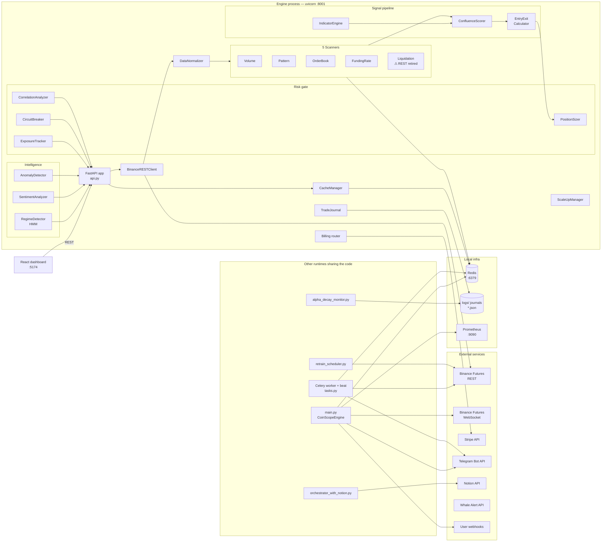
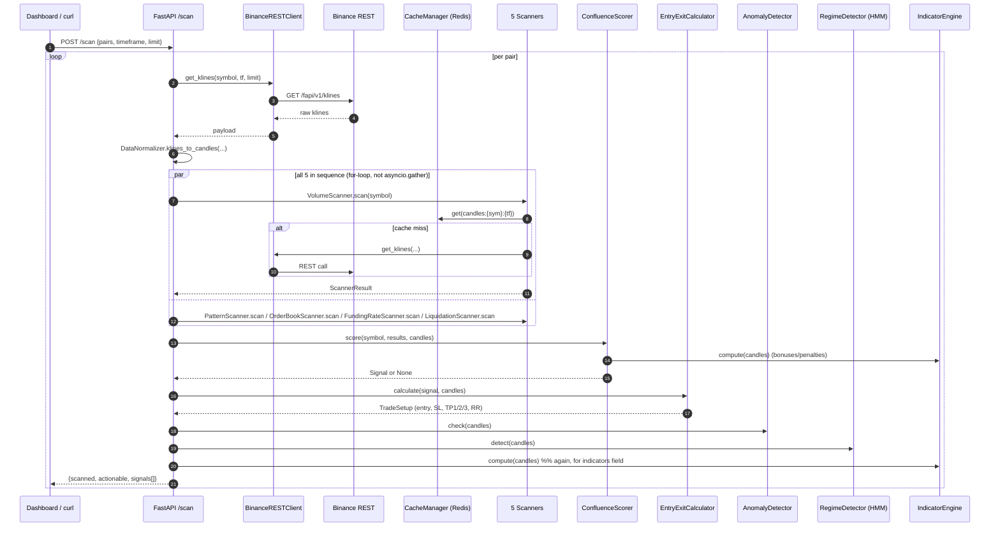

# CoinScopeAI Engine — Internals Walkthrough

> A complete, file-by-file map of what the engine actually is, what runs,
> what talks to what, and what is orphaned.
> Generated 2026-04-19 against branch `restructure/2026-04-18-tier1-docs`.

---

## 1. Executive summary

The engine is a **Python 3.11 async FastAPI service** whose job is to:

1. Pull OHLCV, order-book, mark-price, funding-rate and (historically) liquidation
   data from Binance USD-M Futures.
2. Run 5 parallel "scanners" that each emit typed hits when they see a
   volume spike, candlestick pattern, book imbalance, funding anomaly, or
   liquidation cascade.
3. Fuse those hits + technical indicators into a single 0–100 confluence
   score, then compute entry / SL / TP levels via ATR.
4. Gate any actionable signal through a risk layer (circuit breaker,
   exposure tracker, Kelly sizer, correlation analyzer).
5. Push alerts out (Telegram + webhooks), write a trade journal, and
   (on request) sync to Notion.
6. Expose everything as a REST API on `:8001`.

There are **three independent runtimes** in the tree:

| Runtime | Entry point | What it does | Status |
|---|---|---|---|
| **FastAPI API (primary)** | [`api.py`](../../coinscope_trading_engine/api.py) via `uvicorn api:app --port 8001` | HTTP control/observability surface. Per-request scanning. No background scan loop. | ✅ Running in preview |
| **Standalone engine binary** | [`main.py`](../../coinscope_trading_engine/main.py) (`CoinScopeEngine`) | Live/dry-run process that holds a persistent WS feed + scan loop + alert queue + metrics exporter. | ❌ Not started in this preview |
| **Celery workers + beat** | [`celery_app.py`](../../coinscope_trading_engine/celery_app.py) + [`tasks.py`](../../coinscope_trading_engine/tasks.py) | Scheduled: 5-min scan-all-pairs, 10-min regime, daily summary. Redis broker. | ❌ Not started in this preview |

The React dashboard, billing server, and Prometheus scraper are peer
services outside the engine process.

---

## 2. Topology (what talks to what)



---

## 3. Request path — `POST /scan` end to end

This is the canonical hot path exposed today; every other endpoint is a
read against the same singletons.



Two things worth knowing:

- The per-pair scanner loop is sequential (`for scanner in _scanners`), not
  `asyncio.gather` — if the user runs `/scan` with 10 symbols it does
  `10 × 5 = 50` serial awaits. Fine at 4 pairs, a latency problem at 20+.
- The singletons are instantiated at module import time. Everything you
  see in `/scan` is re-used across requests (no per-request object churn).

---

## 4. Module inventory by layer

### 4.1 Entry surface

| File | Role | Invoked as |
|---|---|---|
| [`api.py`](../../coinscope_trading_engine/api.py) | FastAPI app, 25 routes across 8 tag groups. Eagerly instantiates every engine singleton at import time. | `uvicorn api:app` |
| [`main.py`](../../coinscope_trading_engine/main.py) | `CoinScopeEngine` — full live process: WS feed loop, scan loop, regime loop, health loop, daily-summary loop, alert queue, metrics exporter. | `python main.py --testnet --dry-run` |
| [`master_orchestrator.py`](../../coinscope_trading_engine/master_orchestrator.py) | ccxt-based orchestrator that runs `FixedScorer + RiskGate + MultiTimeframeFilter + HMM + Kelly + sentiment + whale` per pair. | Standalone script |
| [`live/master_orchestrator.py`](../../coinscope_trading_engine/live/master_orchestrator.py) | Live variant using the in-repo `BinanceRESTClient` instead of ccxt. | Subclassed by `orchestrator_with_notion.py` |
| [`orchestrator_with_notion.py`](../../coinscope_trading_engine/orchestrator_with_notion.py) | Live orchestrator + exports trades/portfolio/metrics to Notion after each scan. | Standalone script (`run_loop_with_notion`) |
| [`celery_app.py`](../../coinscope_trading_engine/celery_app.py) | Celery app + beat schedule. Queues: `default`, `ml_tasks`, `alerts`, `scanning`. | `celery -A celery_app worker` / `beat` |
| [`tasks.py`](../../coinscope_trading_engine/tasks.py) | 8 Celery tasks: `run_scan_cycle`, `run_regime_detection`, `run_price_prediction`, `run_anomaly_detection`, `dispatch_telegram_alert`, `dispatch_webhook_alert`, `send_daily_summary`, `backtest_symbol`. | Celery beat + `.delay()` |

### 4.2 Config

[`config.py`](../../coinscope_trading_engine/config.py) — single pydantic-settings `Settings` class,
loaded once as `settings = get_settings()` at import.

- 60 fields + derived properties: `scan_pairs`, `active_api_key`,
  `active_api_secret`, `active_base_url`, `active_ws_url`, `redis_url`,
  `environment`, `max_position_size_pct`, `risk_per_trade_pct`.
- Required env vars: `BINANCE_TESTNET_API_KEY`, `_SECRET`,
  `TELEGRAM_BOT_TOKEN`, `TELEGRAM_CHAT_ID`, `SECRET_KEY`.
- Resolves `.env` from the directory uvicorn runs in (that's why a symlink
  `coinscope_trading_engine/.env → ../.env` was added in this session).

### 4.3 Data layer — `data/`

| Module | Role |
|---|---|
| [`data/binance_rest.py`](../../coinscope_trading_engine/data/binance_rest.py) | `BinanceRESTClient` — async aiohttp client. ~40 methods covering klines, order book, mark price, funding history, 24h ticker, open interest, long/short ratio, taker long/short, **liquidations (retired)**, account, balance, positions, income, place/cancel/amend orders, leverage, margin type, listen-key lifecycle, clock skew. Throws `BinanceRESTError`, `RateLimitError`, `AuthError`. |
| [`data/binance_websocket.py`](../../coinscope_trading_engine/data/binance_websocket.py) | `BinanceWebSocketManager` — persistent, auto-reconnecting signed WS (`ws-fapi/v1`). Session logon, per-weight buckets, subscribe/unsubscribe. **Not referenced by `api.py`**; `main.py` uses the stream adapter. |
| [`data/market_stream.py`](../../coinscope_trading_engine/data/market_stream.py) | `BinanceFuturesStreamClient`, `BinanceFuturesMultiStreamManager` — resilient pub/sub market-data streams (`fstream.binance.com`). `main.py` uses `make_kline_stream` factory. |
| [`data/binance_stream_adapter.py`](../../coinscope_trading_engine/data/binance_stream_adapter.py) | Backend-agnostic facade over three WS impls (native / python-binance / UBWA) selected by `WS_BACKEND`. |
| [`data/cache_manager.py`](../../coinscope_trading_engine/data/cache_manager.py) | `CacheManager` — async Redis wrapper + pub/sub. Helpers for caching tickers, candles, orderbooks, mark prices, signals. Opened in FastAPI `startup`, closed in `shutdown`. |
| [`data/data_normalizer.py`](../../coinscope_trading_engine/data/data_normalizer.py) | Pure transforms from Binance payloads → typed dataclasses (`Candle`, `Ticker`, `OrderBook`, `MarkPrice`, `FundingRate`, `OpenInterest`, `LiquidationOrder`). |

### 4.4 Scanners — `scanner/`

All 5 inherit `BaseScanner(cache, rest, name)` and return a typed
`ScannerResult` containing zero-or-more `ScannerHit`s with
`{direction, strength, score, reason, metadata}`.

| Scanner | What it detects | Data source | Cache key (TTL) |
|---|---|---|---|
| `VolumeScanner` | Volume spike vs N-bar rolling baseline; secondary taker-buy/sell imbalance on spike bar | klines | `candles:{sym}:{tf}` |
| `PatternScanner` | Single / two / three-candle patterns (hammer, doji, marubozu, engulfing, stars, soldiers, pin bar) + basic HH/HL structure | klines | `candles:{sym}:{tf}` |
| `OrderBookScanner` | Bid/ask imbalance, support/resistance walls, spread anomaly | depth | `orderbook:{sym}` (2s) |
| `FundingRateScanner` | Absolute extreme / relative-to-baseline / rapid reversal. Contrarian direction. | mark price + funding history | `mark_price:{sym}` (10s), `funding_history:{sym}` (60s) |
| `LiquidationScanner` | One-sided cascade > threshold with dominance ratio. **REST source retired by Binance; scanner no-ops with one-shot warning.** | liquidations (dead) | `liquidations:{sym}:{N}m` (60s or 300s empty) |

`BaseScanner.start()` exists for a background loop (`asyncio.create_task`) —
currently **not used by `api.py`**, which calls `scanner.scan(symbol)`
per-request. `main.py` does use the loop.

### 4.5 Signal layer — `signals/`

| File | Role |
|---|---|
| [`signals/indicator_engine.py`](../../coinscope_trading_engine/signals/indicator_engine.py) | Pure-numpy indicator engine. `Indicators` dataclass returned by `compute(candles)`. Includes RSI, MACD, Stoch, ATR, Bollinger, ADX, ROC, OBV, VWAP, CMF + derived trend / momentum / volatility labels. |
| [`signals/confluence_scorer.py`](../../coinscope_trading_engine/signals/confluence_scorer.py) | `ConfluenceScorer.score(symbol, scanner_results, candles)` fuses hits + indicator alignment into a 0–100 `Signal` with strength label. Returns `None` below `min_confluence_score` (default 65). |
| [`signals/entry_exit_calculator.py`](../../coinscope_trading_engine/signals/entry_exit_calculator.py) | `EntryExitCalculator.calculate(signal, candles)` → `TradeSetup{entry, SL, TP1/2/3, ATR, risk_pct, rr_ratio, valid, invalid_reason}`. ATR-based with optional structure-SL refinement; enforces `min_rr`. |
| [`signals/signal_generator.py`](../../coinscope_trading_engine/signals/signal_generator.py) | **Orphan** — combines `FixedScorer + HMM + MTF + volume + liquidation` under a weighted vote (0.40/0.25/0.15/0.10/0.10, threshold 0.55). Not used by `api.py`. |
| [`signals/backtester.py`](../../coinscope_trading_engine/signals/backtester.py) | Event-driven bar-by-bar backtester. Own `Backtester(config).run(rest)` → `BacktestResults` (trades, equity, win rate, PF, Sharpe, DD). Not wired to any HTTP endpoint. |

### 4.6 Intelligence — `models/` and `intelligence/`

The `models/` package is the one wired into `api.py`. The parallel
`intelligence/` package is **almost entirely orphan**.

**Wired:**

| File | Role |
|---|---|
| [`models/regime_detector.py`](../../coinscope_trading_engine/models/regime_detector.py) | `RegimeDetector` — Gaussian HMM over log-return features → `MarketRegime` enum. Used by `/regime` and embedded in `/scan`. |
| [`models/sentiment_analyzer.py`](../../coinscope_trading_engine/models/sentiment_analyzer.py) | Composite score from funding + long/short ratio + OI + price/vol divergence + liquidations. Used by `/sentiment`. |
| [`models/anomaly_detector.py`](../../coinscope_trading_engine/models/anomaly_detector.py) | Statistical (return z, volume z, BB-width spike, gap, spread). Used by `/anomaly` and embedded in `/scan`. |
| [`models/price_predictor.py`](../../coinscope_trading_engine/models/price_predictor.py) | LSTM next-bar predictor. **Orphan** — PyTorch lazy-imported, not wired. |

**Orphan (`intelligence/`):**

| File | What it does |
|---|---|
| `hmm_regime_detector.py` | 3-state HMM + RF ensemble labelling bull/chop/bear. Used by `SignalGenerator` + top-level orchestrator only. |
| `finbert_sentiment_filter.py` | FinBERT text gate (Mock by default). Orchestrator only. |
| `funding_rate_filter.py` | Contrarian funding filter via ccxt. Orchestrator only. |
| `kelly_position_sizer.py` | `KellyRiskController` with regime + drawdown multipliers + hard cap. Orchestrator only. |
| `whale_signal_filter.py` | Whale Alert API bias gate. Orchestrator only (`WHALE_ALERT_KEY`). |

### 4.7 Risk — `risk/`

| Module | Role | Endpoint |
|---|---|---|
| `circuit_breaker.py` | `CircuitBreaker` with daily-loss / drawdown / consecutive-loss / rapid-loss tripping. State: CLOSED / OPEN / HALF_OPEN / TRIPPED. Fires async `on_trip` callback. | `/circuit-breaker{,/trip,/reset}` |
| `exposure_tracker.py` | In-memory open-position + PnL tracker. `open_position`, `close_position`, `update_mark_price`, `snapshot`. | `/positions`, `/exposure`, `/position-size` |
| `position_sizer.py` | Fixed-fractional or half-Kelly with leverage + position-pct caps. | `/position-size` |
| `correlation_analyzer.py` | Rolling Pearson between symbols; gates correlated exposures. | `/correlation` |

Note: `core/risk_gate.py` is a **separate, older** risk engine used by
the orchestrators, not `api.py`. It owns its own Position dataclass and
SL/TP/sizing logic. Parallel to `risk/`.

### 4.8 Execution

| File | Role | Wired? |
|---|---|---|
| [`execution/order_manager.py`](../../coinscope_trading_engine/execution/order_manager.py) | `OrderManager` — retry-aware lifecycle over `BinanceRESTClient` with `OrderRecord` state machine, `RetryConfig`, `PollConfig`, fill/error callbacks. | Not by `api.py`. Used by `main.py` (if enabled) and order-flow code. |
| [`binance_testnet_executor.py`](../../coinscope_trading_engine/binance_testnet_executor.py) | `TestnetExecutor` — simulated executor writing to `logs/testnet_*.log`. | Standalone. |
| [`live/binance_testnet_executor.py`](../../coinscope_trading_engine/live/binance_testnet_executor.py) | Live duplicate. | Standalone. |

Neither executor is mounted on the FastAPI surface — the API is currently
**observe-only**. Live order placement runs through `main.py` + Celery or
the orchestrator scripts.

### 4.9 Alerts — `alerts/`

All async. Consumed by `main.py`'s `CoinScopeEngine`, not `api.py`.

| Module | Role |
|---|---|
| `telegram_notifier.py` | `TelegramNotifier` — HTML-formatted signal / status / error / summary / circuit-breaker messages with dedup + retry. Uses httpx to Telegram Bot API. |
| `webhook_dispatcher.py` | `WebhookDispatcher` — multi-endpoint with HMAC signing + per-endpoint health + retries. |
| `alert_queue.py` | `AlertQueue` — priority asyncio queue fanning to Telegram + webhooks. |
| `rate_limiter.py` | Multi-bucket token-bucket (global, per-channel, per-symbol, per-signal). |
| `alpha_decay_monitor.py` (alerts/) | Wraps the top-level monitor. |
| `scale_up_manager.py` (alerts/) | **Duplicate** of the top-level `scale_up_manager.py`. |
| `retrain_scheduler.py` (alerts/) | Wrapper re-exporting `retrain_scheduler`. |
| `telegram_alerts.py` (alerts/) | Older sync Telegram helper. |

### 4.10 Storage — `storage/`

| Module | Role |
|---|---|
| `trade_journal.py` | `TradeJournal` — JSON-backed (`logs/journal.json`). `log_open`, `log_close`, `get_recent_trades(days)`, `daily_summary()`, `performance_stats()`. Backs `/journal`, `/performance`, `/performance/equity`, `/performance/daily`. |
| `trade_logger.py` | Async helper to ship executions to Notion. |
| `notion_simple_integration.py` | Requests-based Notion client: trade log, signal log, portfolio & performance export. |
| `portfolio_sync.py` | Periodic Notion sync of holdings + open positions, with throttling. |

### 4.11 Monitoring — `monitoring/`

| Module | Role |
|---|---|
| `metrics_exporter.py` | Minimal Prometheus wrapper (signals, equity, perf, regime, scan time). |
| `prometheus_metrics.py` | Full `EngineMetrics` layer with no-op fallback when `prometheus_client` is missing. Started by `main.py`. |
| `realtime_dashboard.py` | Console dashboard reading `trades.json` + `PairMonitor`. Standalone CLI. |

### 4.12 Schedulers — top-level

| File | Cadence | What it does |
|---|---|---|
| `retrain_scheduler.py` | Weekly | Rebuilds HMM regime detector on fresh data; persists via storage mgr; Telegrams result. |
| `alpha_decay_monitor.py` | Daily | Win rate, PF, Sharpe, consec-loss on recent trades; alerts on decay. |
| `scale_up_manager.py` | On-demand | Promotes risk profile after N trades at sufficient Sharpe (`Profile` dataclass). |

### 4.13 Billing — `billing/`

| File | Role |
|---|---|
| `stripe_gateway.py` | FastAPI `APIRouter(prefix="/billing")`. Endpoints: `GET /plans`, `GET /subscription`, `POST /checkout`, `POST /portal`, `POST /webhook`. Included by `api.py` at startup. |
| `webhooks.py` | Async Stripe webhook handlers (`checkout.session.completed`, `customer.subscription.updated/deleted`, `invoice.payment_succeeded/failed`). Notifies Telegram. |
| `models.py` | Pydantic schemas + `PlanTier` / `SubscriptionStatus` enums. |

There is **also** a root-level `billing/` package with different modules
(`stripe_checkout.py`, `customer_portal.py`, `webhook_handler.py`,
`pg_subscription_store.py`). The `api.py` `sys.path` fix applied in this
session ensures the engine-local one (which has `stripe_gateway`) wins.

### 4.14 Validation — `validation/`

| File | Role |
|---|---|
| `walk_forward_validation.py` | Offline walk-forward harness around `FixedScorer`. Per-fold Sharpe + DD. CI/standalone only. |

### 4.15 Utils

`utils/helpers.py`, `utils/logger.py`, `utils/validators.py` — shared
helpers, structured logger, and pydantic-ish validators.

---

## 5. Public HTTP surface (as of 2026-04-19)

| Method | Path | Returns | Backed by |
|---|---|---|---|
| GET | `/health` | liveness + version + testnet flag | `settings` |
| GET | `/config` | safe config dump | `settings` |
| GET | `/signals` | last cached scan result | in-process `_signal_cache` |
| POST | `/scan` | `{scanned, actionable, signals[]}` | scanners → scorer → EEC → regime/anomaly/indicators |
| GET | `/positions` | balance, notional, exposure, `positions[]` | `ExposureTracker` |
| GET | `/exposure` | same as above, + `is_over_exposed` | `ExposureTracker` |
| GET | `/circuit-breaker` | state, trip count, thresholds | `CircuitBreaker` |
| POST | `/circuit-breaker/reset` | resets breaker | `CircuitBreaker` |
| POST | `/circuit-breaker/trip` | manually trips | `CircuitBreaker` |
| GET | `/regime` | HMM regime per symbol (optional v3 classifier) | `RegimeDetector` + optional `ml/regime_classifier_v3.pkl` |
| GET | `/sentiment` | composite score | `SentimentAnalyzer` + REST funding rate |
| GET | `/anomaly` | anomaly flags + severity | `AnomalyDetector` |
| GET | `/position-size` | qty/notional/risk/method | `PositionSizer` |
| GET | `/correlation` | rolling Pearson pairs | `CorrelationAnalyzer` |
| GET | `/journal` | recent journal entries | `TradeJournal` |
| GET | `/performance` | PF, Sharpe, DD (or `total_trades=0` stub) | `TradeJournal.performance_stats()` |
| GET | `/performance/equity` | `{equity_curve[], current_equity, initial_capital}` | `TradeJournal` |
| GET | `/performance/daily` | single-day summary (not a series) | `TradeJournal` |
| GET | `/scale` | current profile + progress | `ScaleUpManager` |
| POST | `/scale/check` | evaluate promotion | `ScaleUpManager` |
| GET | `/validate` | validation-mode checks | inline |
| GET | `/billing/plans` | 4 tiers | `billing/stripe_gateway` |
| GET | `/billing/subscription` | current sub status | ditto |
| POST | `/billing/checkout` | Stripe checkout session | ditto |
| POST | `/billing/portal` | Stripe customer portal | ditto |
| POST | `/billing/webhook` | Stripe webhook sink | `billing/webhooks.py` |

---

## 6. External dependencies

| System | Purpose | Used by |
|---|---|---|
| Binance USD-M Futures REST | Market data + (in `main.py`) order placement | `BinanceRESTClient`, every scanner |
| Binance USD-M Futures WS | Live klines, depth updates, user-data stream | `main.py`, `BinanceWebSocketManager`, `market_stream.py` |
| Redis | Scanner cache, Celery broker + result backend, pub/sub | `CacheManager`, `celery_app.py` |
| Stripe | Subscription billing | `billing/stripe_gateway.py` |
| Telegram Bot API | Alerts + daily summaries + error channel | `TelegramNotifier`, `main.py`, Celery tasks |
| Notion API | Trade journal / portfolio / performance mirror | `SimpleNotionIntegration`, `PortfolioSync` |
| Whale Alert API | On-chain whale bias for filter | `WhaleSignalFilter` (orchestrator only) |
| Prometheus | Metrics scraping | `monitoring/metrics_exporter.py` + `prometheus.yml` |
| Filesystem | Journals, state, logs | `logs/*.json`, `logs/coinscope.log`, `logs/testnet_*.log` |
| SQLite (billing) | Subscription store (root-level billing package) | `billing_server.py` (not the engine-local router) |

---

## 7. Known duplicates & orphans

Result of the Apr 2026 tier-1 docs pass not yet having pruned the pre-restructure siblings:

- `scale_up_manager.py` exists at root AND at `alerts/`.
- `trade_journal.py` has a sibling `trade_journal (2).py` with a filename
  space (never imported).
- `whale_signal_filter.py` has a sibling `whale_signal_filter (1).py`.
- Top-level copies of `master_orchestrator.py`, `pair_monitor.py`,
  `retrain_scheduler.py`, `notion_simple_integration.py`, etc. all have
  "canonical" counterparts under `live/`, `storage/`, `alerts/`.
- `intelligence/` package (5 modules) is completely unreferenced by
  `api.py`; only the orchestrator scripts use it.
- `signals/signal_generator.py` + `signals/backtester.py` are not wired
  to any HTTP route.
- `models/price_predictor.py` (PyTorch LSTM) is lazy-imported from
  nowhere.
- Root-level `binance_*_client.py` and `binance_testnet_executor.py` are
  copies of `live/*` variants.

None are load-bearing — `api.py` explicitly imports its 10 dependencies
from specific subpackages. The duplicates just inflate the tree and are
the main reason this branch's `coinscope_trading_engine/` layout is
being replaced by the post-PR-11 `engine/` layout on `main`.

---

## 8. What breaks without what

| If down | Impact |
|---|---|
| Redis | Scanners error (`CacheManager not connected`). `api.py`'s startup hook logs the error but keeps serving `/health`, `/config`. `/scan` will fail per-symbol. |
| Binance REST | Every scanner fails with `HTTP …`. `/regime`, `/sentiment`, `/anomaly` fail too (they need klines). `/positions` etc. stay OK (pure in-memory). |
| Stripe keys | `/billing/checkout` returns 503. Other routes unaffected. |
| Telegram creds | `main.py` alert queue refuses to start; api.py doesn't use Telegram so unaffected. |
| ml/models/regime_classifier_v3.pkl missing | `/regime` silently falls back to HMM. |
| Notion token | Orchestrator logs "export failed" each cycle; rest of engine unaffected. |

---

## 9. What Phase 2 needs from the engine

Re-stated from the dashboard gap report, grounded in this walkthrough:

| Dashboard feature | Engine status today | Phase 2 work |
|---|---|---|
| Live liquidations / cascades | REST source retired; WS stream untouched | Add `!forceOrder@arr` WS consumer + in-memory deque + `/liquidations?symbol=&since=` endpoint |
| Regime history timeline | `/regime` is point-in-time | Persist regime snapshots in Redis list or journal; add `/regime/history?symbol=&days=` |
| Funding-rate panel | `FundingRateScanner` has the data but returns only via `/scan` metadata | Add `/funding?symbol=` passthrough to `BinanceRESTClient.get_mark_price` |
| Order-book imbalance card | `OrderBookScanner` has the data | Add `/orderbook/imbalance?symbol=` passthrough |
| Alerts history | Alerts are sent, not stored | New `alerts_log.json` + `/alerts?since=&limit=` |
| Kill-switch alert log | `/circuit-breaker` gives current state only | Track trip events on the breaker, expose via `/circuit-breaker/history` |
| Backtest results | `signals/backtester.py` unused | Wire `/backtest/run` (async task) + `/backtest/last`; or expose pre-computed artifacts from `ml/` |
| Multi-exchange market data | Binance-only | Either add Bybit/OKX/Hyperliquid adapters (README "Planned") or proxy Coinglass |
| System status panel | `/health` is binary; no WS state | Expose WS connection state + per-feed latency + Telegram stats via a new `/status` roll-up |

---

## 10. How to run each runtime

```bash
# 1. FastAPI (primary — what preview mode uses)
cd coinscope_trading_engine
../venv/bin/uvicorn api:app --host 127.0.0.1 --port 8001

# 2. Standalone engine binary
cd coinscope_trading_engine
../venv/bin/python main.py --testnet --dry-run

# 3. Celery worker + beat (needs Redis)
cd coinscope_trading_engine
../venv/bin/celery -A celery_app worker -Q default,ml_tasks,alerts,scanning --loglevel=INFO
../venv/bin/celery -A celery_app beat --loglevel=INFO

# 4. Notion-mirroring orchestrator
cd coinscope_trading_engine
../venv/bin/python orchestrator_with_notion.py

# 5. Weekly ML retrainer
cd coinscope_trading_engine
../venv/bin/python retrain_scheduler.py

# 6. Console dashboard (reads trades.json)
cd coinscope_trading_engine
../venv/bin/python monitoring/realtime_dashboard.py
```

Only runtime #1 is started in the current preview. Runtimes #2–#6 are
dormant on this branch.
