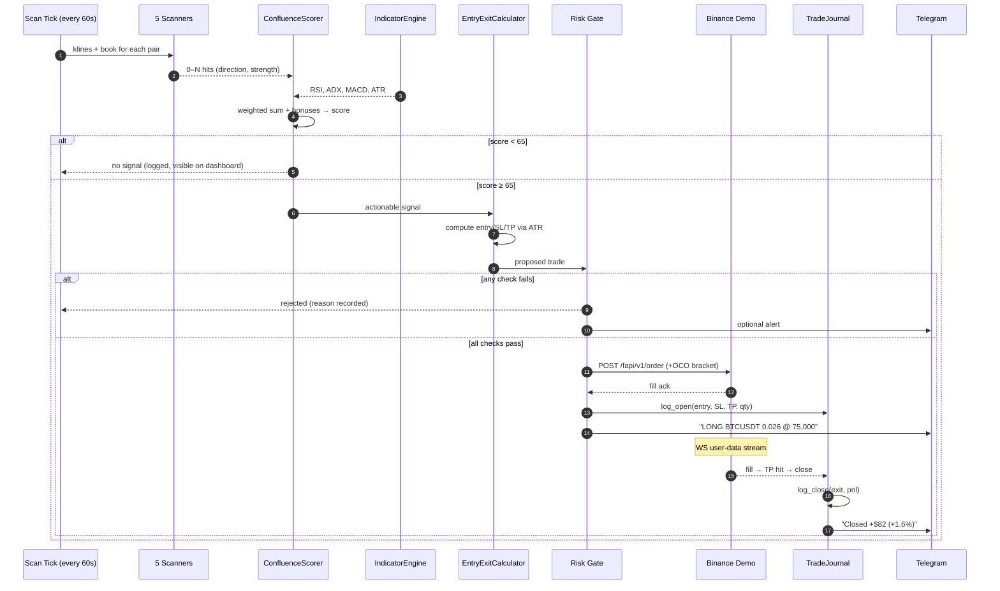

# CoinScopeAI Trading Pipeline — Plain English + Roadmap to Auto-Trading

> Written 2026-04-20. This is the "you bought a tool, now let's turn it on"
> document. First half explains what the algorithm is actually doing every
> second. Second half is the phased plan to go from "signals on a screen"
> to "orders on Binance Futures Demo with full supervision".

---

## 1. What the engine really is, in 5 sentences

- Every N seconds it downloads 1-hour candles + order book + funding data for
  4 symbols (BTC, ETH, SOL, BNB) from Binance.
- Five independent **scanners** each look at that data and raise their hand
  when they see something specific (a volume spike, a bullish engulfing
  pattern, a support wall, an extreme funding rate, a liquidation cascade).
- A **ConfluenceScorer** adds up those raised hands, weights them by how
  strong each one is, and boosts or penalises the total based on classic
  indicators (RSI, ADX, MACD). Output: one number 0–100 per symbol.
- If that number beats a threshold (default 65), an **EntryExitCalculator**
  uses the ATR (how volatile the symbol is right now) to pick an entry, a
  stop-loss, and three take-profits that give a favourable risk/reward.
- Then a **Risk Gate** decides whether to actually take the trade: are we
  already at max positions, are we down too much today, is the breaker
  tripped, is the pair correlated with one we already hold.

That's it. No magic, no LLM on the hot path, no secret indicator. The alpha
is in **confluence** (many weak signals agreeing are worth more than one
strong one) and in **discipline** (the risk gate is strict).

---

## 2. What each scanner is actually measuring

### VolumeScanner → "Is the crowd suddenly loud?"
Compares the most recent candle's volume to the rolling 20-bar average.
Fires when volume is ≥ 3× the average **and** the candle has a clear
direction (body > 60% of range). Secondary: if the spike candle is
dominated by taker-buy volume it nudges LONG, taker-sell nudges SHORT.

Why it matters: volume spikes often precede trend continuation or
reversal — depends on what the other scanners say.

### PatternScanner → "Does this candle rhyme with something the market usually respects?"
Pure price-action. Looks at the last 1–3 candles for:
- **Single**: hammer, inverted hammer, shooting star, doji, marubozu,
  long upper/lower wick
- **Two**: bullish/bearish engulfing, tweezer tops/bottoms, piercing line,
  dark cloud cover
- **Three**: morning star, evening star, three white soldiers, three
  black crows
- **Structure**: simple HH/HL (higher-high, higher-low) for trend detection

Each match emits a hit with a direction and strength (WEAK/MEDIUM/STRONG).

### OrderBookScanner → "Where are the walls?"
Looks at the top 20 levels of the live order book:
- **Imbalance**: bid volume vs ask volume. >65% on one side → directional
  pressure.
- **Walls**: a single price level with ≥ 5× the average depth nearby.
  Big bid walls below price = support (LONG bias). Big ask walls above =
  resistance (SHORT bias).
- **Spread anomaly**: unusually wide spread → low liquidity, caution.

### FundingRateScanner → "Is the market crowded on one side?"
Perpetual futures charge a funding fee every 8 hours. If funding is
extreme positive it means longs are paying shorts (crowded longs) — that's
often a fade signal: **short** the crowded longs. Extreme negative =
crowded shorts = fade **long**. Also tracks rapid reversals (funding that
flipped sign recently).

### LiquidationScanner → "Are forced exits happening?"
Large one-sided liquidations often mark local extremes — the cascade
exhausts weak-handed positions. Counter-trend bias: heavy long
liquidations → likely bounce → LONG opportunity.

**Current status**: Binance retired the REST endpoint (2025). The scanner
no-ops gracefully and emits a warning once. Phase 3g will re-wire it via
the `!forceOrder@arr` WebSocket stream.

---

## 3. The score, in numbers

Each scanner hit has:
- **direction** — LONG, SHORT, or NEUTRAL
- **strength** — WEAK (weight 1) / MEDIUM (weight 2) / STRONG (weight 3)
- **score** — 0–45 point contribution

The scorer:
1. Sums points per direction, taking the dominant one.
2. Applies **indicator bonuses**: agrees with RSI bias? +5. Agrees with
   ADX trend strength? +5. Agrees with MACD cross? +5. Disagrees?
   –5 each.
3. Caps at 100, labels the strength:
   - 0–39: WEAK (noise)
   - 40–59: MODERATE
   - 60–79: STRONG
   - 80–100: VERY_STRONG
4. `min_confluence_score = 65` — only signals ≥ 65 are **actionable**
   (would be allowed to become a trade).

You see every score on the dashboard Scanner page. Now you'll know what
they mean.

---

## 4. The entry / stop / target maths

Once we have a signal, `EntryExitCalculator` computes a setup using the
**Average True Range** (ATR) — a measure of how much the asset typically
moves per bar.

```
entry      = current price (or mid-price)
stop_loss  = entry – (1.5 × ATR)   [LONG]   or  entry + (1.5 × ATR) [SHORT]
tp1        = entry + (1.5 × ATR)   [LONG]
tp2        = entry + (3.0 × ATR)
tp3        = entry + (4.5 × ATR)
risk_pct   = (entry – stop_loss) / entry × 100
rr_ratio   = (tp2 – entry) / (entry – stop_loss)
```

A setup is **valid** only if `rr_ratio ≥ min_rr` (default 1.5). Also
applies a structure-SL refinement: if the recent candles have a tighter
swing low/high than the ATR distance, SL is snapped there.

---

## 5. The risk gate — why the engine is cautious

Before a signal can become a trade, the **Risk Gate** checks all of:

| Check | Source | Hard limit |
|---|---|---|
| Circuit breaker state | `CircuitBreaker` | must be CLOSED |
| Daily loss | `ExposureTracker.daily_loss_pct` | ≤ 2% (configurable) |
| Max drawdown | `ExposureTracker` | ≤ 10% |
| Consecutive losses | `CircuitBreaker.consec_losses` | ≤ 5 |
| Open position count | `ExposureTracker.position_count` | ≤ `max_open_positions` (3) |
| Total exposure | `ExposureTracker.total_exposure_pct` | ≤ 80% |
| Per-trade risk | `PositionSizer` | ≤ 2% hard cap (Kelly ceiling) |
| Max leverage | config | ≤ 10x |
| Correlation | `CorrelationAnalyzer` | no two highly-correlated pairs |

If any check fails the trade is dropped. The engine logs *why* it
dropped — that's what you'll see in the new "pipeline transparency"
page (Phase 3e).

Position sizing itself uses fixed-fractional by default:
```
risk_usd    = balance × risk_per_trade_pct   (1% = $50 on $5k demo)
qty         = risk_usd / (entry – stop_loss)
notional    = qty × entry
margin_req  = notional / leverage
```

That's why you see `qty = 0.0260 BTC` when the engine sizes up a BTC
trade at $75k with 1% risk and a 2% stop.

---

## 6. The lifecycle of one trade (diagram)



---

## 7. Roadmap: "signals on screen" → "trading autonomously"

Each phase ends with a **visible, verifiable result** on the dashboard.

### Phase 3a — Continuous scan loop (safe, no trading yet)
*ETA: 30 min. Risk: zero.*

- New background task in `api.py` that runs the full scan pipeline every
  `SCAN_INTERVAL_SECONDS` (default 60 s) for every pair in `scan_pairs`.
- Results land in the existing `_signal_cache`; the Scanner page updates
  on its own without clicking "Run Scan".
- New `/scan/status` endpoint: last scan ts, next scan in Ns, per-pair
  errors.
- Dashboard: status chip "Last scan 7s ago · next in 53s", scans counter.

**What you'll see**: Live Scanner page constantly ticks — BTCUSDT SHORT 74,
ETHUSDT LONG 40, etc. — refreshed automatically. No orders placed. This
is the "watch the algorithm decide" phase.

### Phase 3b — Manual trade placement
*ETA: 1–2 h. Risk: low (you click the button).*

- `POST /orders {symbol, side, type, qty, price?, stop_price?, tif, reduce_only, client_id?}`
  → validates against risk gate → `BinanceRESTClient.place_order`.
- `DELETE /orders/{id}?symbol=` — cancel.
- `GET /orders/open` — list.
- Dashboard: "Execute" button on each Scanner row with pre-filled qty
  from `PositionSizer`. Click → confirm dialog showing the risk
  breakdown → order placed on Binance Futures Demo.
- "Close" button on Positions page → market close that position.

**What you'll see**: You manually execute a strong signal. Binance
shows the position. PnL updates live on Overview via the existing WS
feed. You stay fully in the loop.

### Phase 3c — Auto-execution (safety-gated)
*ETA: 2 h. Risk: real (engine places orders for you).*

- New `trade_executor` module: when a scan produces an actionable signal
  AND auto-trade is enabled AND risk gate approves, place a MARKET entry
  with an OCO (one-cancels-other) bracket for SL + TP2.
- Controls:
  - `POST /autotrade/enable` / `POST /autotrade/disable`
  - `POST /autotrade/config {max_position_size_pct, …}` (live-update
    without restart)
  - Kill switch (already exists via `/circuit-breaker/trip`) halts
    entries; doesn't close existing.
- Dashboard: a big "AUTO-TRADE ▶/◼" toggle in Settings, clearly gated
  with a confirm modal. When ON, new trades appear automatically.
- Heartbeat alert to Telegram every 15 min: "autotrade ON · 2 open ·
  +$12 today".

**What you'll see**: Dashboard gains a banner "Auto-trade ON since
12:04 · 3 trades today · +$48". Signals that pass the gate become
actual positions on Binance without your click.

### Phase 3d — Real-time fills via listen-key
*ETA: 1 h. Risk: zero (observability only).*

- `POST /fapi/v1/listenKey` every 30 min to keep a session alive.
- Persistent WS to `wss://demo-fstream.binance.com/ws/{key}`.
- Handle:
  - `ACCOUNT_UPDATE` → instant balance sync
  - `ORDER_TRADE_UPDATE` → if status is FILLED, update journal, close
    position in ExposureTracker, emit Telegram.
- Drops REST polling latency from 10 s to ~200 ms.

**What you'll see**: When your order fills on Binance, the dashboard
reflects it in under a second. Closed trades appear in Journal with
PnL the instant the TP/SL hits.

### Phase 3e — Controls & full observability
*ETA: 2 h. Risk: zero.*

- New **Pipeline** page on the dashboard showing, for every recent
  scan tick and every pair, the *exact* decision trace:
  - candles fetched / cache status
  - hits by scanner (with reasons)
  - indicator values
  - raw confluence → final score
  - actionable yes/no, threshold
  - if actionable: risk gate verdict + reason
  - if passed: order id + fill price
- Full transparency → you can see exactly why the engine did or didn't
  trade.
- **Settings** page: leverage picker, scan-interval slider, `min_score`
  slider, `risk_per_trade_pct` slider, pair whitelist.

**What you'll see**: A Bloomberg-terminal-style trace per scan. You
understand every decision.

### Phase 3f — Backtest integration
*ETA: 3 h. Risk: zero (backtests never hit the exchange).*

- New `POST /backtest/run {pairs, days, config_overrides}` kicks off
  `signals/backtester.py` async, returns a job id.
- `GET /backtest/jobs/{id}` returns progress + results (win rate, PF,
  Sharpe, max DD, equity curve).
- Dashboard Backtest Results page populated with the real artefacts.
- Optional: walk-forward validator (`validation/walk_forward_validation.py`)
  produces a 3-fold report saying "this config was profitable
  out-of-sample in X of 3 recent quarters".

**What you'll see**: A "Confidence" panel on Settings: "Based on last
30 days of BTC/ETH/SOL/BNB 1h data, current config backtested at 63%
win rate, PF 2.1, max DD 6.4%, 41 trades." Numbers shift when you
tweak sliders.

### Phase 3g — Re-enable the liquidation feed
*ETA: 1 h. Risk: zero.*

- Subscribe to `wss://demo-fstream.binance.com/ws/!forceOrder@arr`,
  buffer events in an in-memory deque per symbol.
- `LiquidationScanner` reads from the deque instead of the retired REST.
- Reactivate it in the scanner list.

**What you'll see**: Liquidation cascades scanner starts contributing
again; score distribution shifts.

---

## 8. Why this order?

- 3a is free insurance — we let the engine run for a few hours with
  zero trading risk. If its signals are bad we find out before a dollar
  is at stake.
- 3b before 3c so you know exactly what the button feels like before we
  hand the button to the engine.
- 3d before 3e so the pipeline page can show real fill data.
- 3f last so we have live signals to compare the backtest against.

---

## 9. Safety invariants that apply throughout

- `TESTNET_MODE=true` is asserted before every `place_order`. The engine
  refuses to place orders when it's false unless an explicit
  `ALLOW_LIVE_TRADING=true` guard is also set (not in .env today).
- Every order carries a `client_order_id` prefixed `cs-…` derived from
  a nanoid. If a retry is needed the same id is reused — Binance rejects
  duplicates so we never place twice.
- `max_leverage=10`, `risk_per_trade_pct=1`, `max_open_positions=3`,
  `max_total_exposure_pct=80`, `max_daily_loss_pct=2` — these are the
  guardrails.
- Kill switch (`POST /circuit-breaker/trip`) immediately halts new
  entries and is already wired on the Risk Gate dashboard page.

---

## 10. What I'll show you at each checkpoint

- **After 3a**: a video-style screenshot of the dashboard updating a
  scan every 60 s by itself.
- **After 3b**: one manual trade opened on Binance via the dashboard
  "Execute" button; proof on `/account/positions` and on the Binance
  demo wallet page.
- **After 3c**: an auto-opened trade (I'll run the engine for 30 min
  and capture whatever it does). First real P&L number.
- **After 3d**: fill latency chart — REST-polled vs WS-driven.
- **After 3e**: screenshot of the Pipeline page explaining one scan's
  decision tree.
- **After 3f**: backtest report with 100+ trades.
- **After 3g**: liquidation signals reappearing in the Scanner page.

Ask me to hold on any phase and I will; ask me to skip one and I will.
